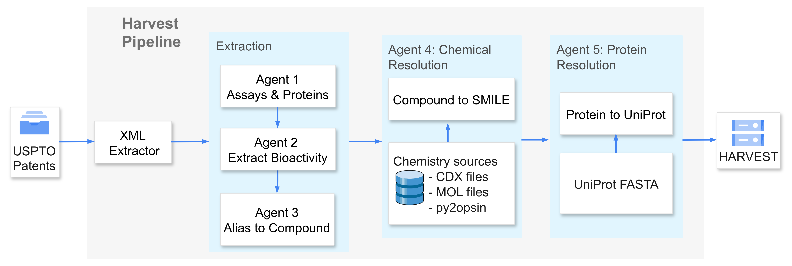

# HARVEST

**HARVEST** (High-throughput Automated extRaction of bioactivity from patentS using agenTic LLMs) is a multi-agent LLM system for automated extraction of protein-ligand bioactivity data from USPTO patents. The pipeline processes patent documents through specialized agents for assay identification, bioactivity extraction, compound name resolution, chemical structure resolution, and protein mapping to UniProt identifiers.

From 43,187 USPTO patents, HARVEST extracted 3.15 million activity records, identifying 326,342 novel molecular scaffolds and 967 protein targets absent from existing databases like BindingDB.



## Links

- **Paper**: [biorxiv:10.64898/2026.03.15.711910](https://www.biorxiv.org/content/10.64898/2026.03.15.711910)
- **H-bench (legacy)**: [h-bench](./data/h_bench)

## ⚠️ H-bench Notice

H-bench is a legacy subset released with the initial paper. The full HARVEST
dataset — which will include all data currently in H-bench — is coming soon. We
recommend waiting for the full release rather than building on H-bench alone.

For reference, the H-bench dataset schema and training-data allocation
instructions are preserved in [Appendix: H-bench](#appendix-h-bench-legacy-dataset)
at the bottom of this file.

---

## Pipeline

Harvest extracts bioactivity data from USPTO patents (XML/ZIP with embedded MOL
structures) using an LLM-based pipeline and assembles a BindingDB-like table in
Parquet format.

The primary output is rows of the form:

> ligand - protein target - activity metric - value - units - patent source

enriched with SMILES, InChIKey, UniProt accession/ID, and protein sequence.

## Data flow

```text
USPTO Open Data Portal
  -> uspto_download/             bulk archives -> one ZIP per patent
ZIP patents (XML/MOL)
  -> patent_processor            parse ZIP/XML/MOL, RDKit structure extraction
  -> LLM extraction (Agent 1)    llm/ + bioactivity_extraction/
  -> protein_postprocessor       protein/complex names -> gene/UniProt/sequence
  -> verify_llm_res              hallucination annotation (_hallu.json sidecars)
  -> export_table.py             normalize + enrich -> BindingDB-like Parquet
  -> annotate_novelty.py         optional: novelty / cluster / Tanimoto columns
```

`Agent 1` / `Agent 2` are historical names kept in the code. The extractor is
`llm/extractor.py`, class `BioactivityExtractor`.
"Agent 2" now only tags each extracted row with the provenance the export filters
on; the separate LLM-based alias resolver it used to run was removed, because the
export discarded everything it produced.

## Requirements

- Python 3.10+
- Runtime dependencies: `pip install -r requirements.txt`

Some chemistry helpers rely on RDKit and OPSIN (installed via requirements).
`pycdxml` is installed from a Git source (see `requirements.txt`).

## Configuration

Configuration is read from environment variables (see `llm/config.py` for the
model settings and `pipeline/config.py` for worker counts). Copy `.env.example`
to `.env` and fill in your values:

```bash
cp .env.example .env
```

Key variables:

- `LLM_KEY`, `LLM_URL`, `LLM_MODEL`, `LLM_TEMPERATURE`
- `PROTEIN_LLM_MODEL` - the `proteins` stage runs on its own model (default
  `openai/gpt-5.1`), so it does not follow `LLM_MODEL`
- `LLM_API_RETRY_ATTEMPTS`, `LLM_API_RETRY_DELAY`
- `PIPELINE_MAX_WORKERS`, `PIPELINE_QUEUE_SIZE`
- optional OpenRouter provider settings
- optional direct Gemini API via `USE_GOOGLE_DIRECT`

For extraction quality a low temperature is expected, usually
`LLM_TEMPERATURE=0`.

## Input data (not included)

Patent corpora and protein reference data are NOT part of this repository. You
need to provide them locally. Patents can be fetched from USPTO with
[`uspto_download/`](#getting-patents-from-uspto); protein data must be
downloaded separately.

Local protein data is expected at `data/protein_data/`:

```text
data/protein_data/
  uniprot_sprot.fasta
```

Fetch it once, before any run that includes the `proteins` stage:

```bash
python scripts/download_protein_data.py
```

That downloads Swiss-Prot from the UniProt current release (~90 MB compressed,
~275 MB and about 575k sequences once unpacked) and writes
`data/protein_data/uniprot_sprot.fasta`. It skips the download when the file is
already there, so it is safe to re-run; pass `--force` to refresh it.

That single file is what the protein step needs. `protein_postprocessor` loads
it through `FastaGeneResolver` (see `UNIPROT_FASTA_PATH` in
[`protein_postprocessor/config_postprocess.py`](protein_postprocessor/config_postprocess.py))
to look up a sequence by gene symbol and species. The `proteins` stage checks
for it up front and stops with a pointer to the script if it is absent, rather
than failing after extraction has already spent LLM budget.

Older instructions also asked for `HUMAN_9606_idmapping.dat`,
`MOUSE_10090_idmapping.dat` and `RAT_10116_idmapping.dat`. Those were read only
by the legacy `ProteinResolver`, which has been removed — no code reads them
now, so they are no longer needed.

## Getting patents from USPTO

The pipeline consumes one ZIP per patent, each holding the patent XML and any
embedded MOL structure files. USPTO does not publish patents that way — it
publishes large bulk archives — so this is a two-step process.

### 1. Get an API key

Bulk downloads go through the USPTO Open Data Portal, which requires a free API
key. Request one at
[data.uspto.gov/apis/getting-started](https://data.uspto.gov/apis/getting-started)
and set `USPTO_TOKEN`, either in `.env` alongside the LLM settings:

```ini
USPTO_TOKEN = "your_uspto_api_key_here"
```

or in the environment:

```bash
export USPTO_TOKEN=your_key_here
```

### 2. Download the bulk archives

```bash
python -m uspto_download.download_bulk \
  --product APPDT \
  --start 2021-01-01 --end 2022-01-01 \
  --out data/uspto_bulk \
  --logfile data/uspto_bulk/download_log.txt
```

`--product` is a USPTO dataset identifier; `APPDT` is published patent
applications. The date range is walked in three-month windows because the API
limits how much one request may return. Downloads resume: an archive already
present at its expected size is skipped, as is anything marked `DONE` in
`--logfile`. Expect tens of GB for a multi-year range.

`--workers` sets how many archives download at once (default 2). USPTO
rate-limits per key, so raising it mainly buys retries; the client already
backs off on HTTP 429.

### 3. Extract the per-patent ZIPs

```bash
python -m uspto_download.extract_patents \
  -i data/uspto_bulk \
  -o data/patents \
  --start 2021 --end 2022 \
  --with-mols --regex-xml
```

This walks each bulk archive, opens the nested per-patent ZIPs, and keeps only
the ones worth running:

| Flag | Keeps a patent when |
|---|---|
| `--with-mols` | it ships embedded structure files, MOL or CDX (default on) |
| `--regex-xml` | its text mentions a binding metric — IC50, EC50, Ki, Kd, Ka and their log/HTML-subscript variants (default off) |


## Usage

The recommended flow is five separate steps. They can also be chained by
`pipeline.py` as run stages (`extract`, `proteins`, `verify`, `export`,
`postprocess`), see [Whole run in one command](#whole-run-in-one-command).

### Step 1 — Extraction (patents → per-patent JSON)

```bash
python pipeline.py \
  --input-path path/to/patents_or_dir \
  --output-dir results/my_run \
  --stages extract \
  --debug
```

Useful flags:

- `--input-path`: a single ZIP or a directory of ZIPs
- `--input-list`: a text file listing ZIP archives (one per line)
- `--limit`: cap the number of patents
- `--resume`: skip already processed patents
- `--debug`: write the extra diagnostic artifacts (`chemistry/`,
  `debug_error_log.jsonl`, `llm_failed_requests.jsonl`). The per-stage LLM TSVs
  are written on every successful run, with or without it.
- `--stages extract`: run only this step, leaving the per-patent
  `*_resolved.json` files for steps 2 and 3 to consume. Omit `--stages` and the
  run defaults to `extract,proteins,export`, doing steps 1-3 in one command.

`--stages` takes a comma-separated list, or `all`:

```bash
--stages extract                         # step 1 only
--stages extract,proteins,verify,export  # steps 1-4 (the default when omitted)
--stages all                             # steps 1-5, adding final_postprocessing
--stages export                          # re-export an existing results directory
--stages export,postprocess              # rebuild the Parquet, no LLM calls
```

`extract` and `proteins` are the only stages that call an LLM. To rebuild the
Parquet from a directory of released per-patent results, run `verify` to produce
the `_hallu.json` sidecars and then export:

```bash
python pipeline.py \
  --output-dir path/to/llm_results \
  --stages verify,export,postprocess \
  --verify-source-dir path/to/patent_zips \
  --patent-dict curated_data/patent_mapping.csv
```

The `verify` stage writes per-patent `_hallu.json` sidecars that the `export`
stage reads to drop hallucinated rows at build time. It needs the patent ZIP
directory (`--verify-source-dir`, or `input.path` when running the full
pipeline). Sidecars already on disk are skipped, so the cost is paid only once.

This needs no API key and no `.env`: credentials are required only when a stage
actually builds an LLM client. `--output-dir` is both the input and the output
here — the export reads the `*_resolved.json` files already in it and writes
`main_res.parquet` and `main_res_clean.parquet` alongside them.

See [Whole run in one command](#whole-run-in-one-command) for `--from-stage` and
for driving the same choice from a config file.

### Step 2 — Protein postprocessing (names → gene/UniProt/sequence)

```bash
python -m protein_postprocessor results/my_run --workers 5
```

Produces `single_proteins.json` and `protein_complexes.json` per patent.

### Step 3 — Hallucination annotation (`verify_llm_res`)

```bash
python -m verify_llm_res \
  --results-dir results/my_run \
  --source-dir  path/to/patent_zips \
  --workers 16
```

Checks each patent's Stage 2/3 TSVs against its XML source and writes a
`{patent_id}_hallu.json` sidecar next to the `_resolved.json`. The sidecar
flags chemical IDs, IUPAC names, and activity values that do not appear in the
patent text. The `export` stage reads these sidecars and drops flagged rows at
build time.

Existing sidecars are skipped (use `--force` to overwrite). `--force-hallu`
re-runs only patents whose sidecar has non-empty flags.

### Step 4 — BindingDB-like Parquet export

```bash
python export_table.py \
  results/my_run \
  results/my_run/main_res.parquet \
  --workers 6
```

`export_table.py` is local-only (RDKit) by default. The OPSIN IUPAC→SMILES path
(`--use-opsin`) is opt-in.

This step also decides the species provenance of every row and writes it into
`organism`. When the patent named the species, that label is kept (`human`,
`rat`, ...). When it did not and the row is still annotated as human, `organism`
is `human (default)`. Viral/bacterial targets with no stated species stay
`unspecified` (`inferred_from_target` internally). Nothing is silently
relabelled as Homo sapiens, and the decision is computed from existing
artifacts, so no agent has to be re-run. There is no separate `species_source`
column.

A human sequence is never kept under a stated non-human species. When the text
names another organism, the human components are dropped from the parallel
`gene` / `UniProt ID` / `Target accession` / `Sequence` lists: a complex loses
only its human subunits, a single target keeps its `gene` and loses the
sequence. Labels that name an expression system rather than a species (`CHO`,
`HEK-293`, `SH-SY5Y`) count as "species not stated" and become
`human (default)`. For those rows `organism_scientific` is `Homo sapiens`
when the UniProt is human, except if the scientific name is already a virus or
bacterium.

### Step 5 — Optional Parquet cleanup (`final_postprocessing`)

After `main_res.parquet` exists, optionally add clean/best SMILES columns and
apply cleaning filters in one command:

```bash
python -m final_postprocessing \
  results/my_run/main_res.parquet \
  results/my_run/main_res_clean.parquet
```

Details and flags: [`final_postprocessing/README.md`](final_postprocessing/README.md).
`add_final_structure.py` is a separate optional script and is not included in
the one-command chain.

### Step 6 — Optional novelty annotation (`annotate_novelty.py`)

Adds chemical-novelty columns to a finished build by clustering its compounds
against BindingDB, one protein target at a time:

```bash
python annotate_novelty.py \
  --harvest results/my_run/main_res_clean.parquet \
  --bdb path/to/bindingdb_reference.parquet \
  -o results/my_run/novelty
```

| Column | Meaning |
|---|---|
| `cluster_id` | Tanimoto cluster, namespaced as `<uniprot>_<n>` |
| `novelty_label` | `Novel` / `Buffer` / `Boundary` (categorical) |
| `nearest_BDB_smiles` | Most similar BindingDB compound |
| `tanimoto_sim` | Similarity to that compound |

`Novel` means the compound's cluster holds no BindingDB compounds, `Buffer` a
cluster in the separating buffer zone, and `Boundary` a cluster whose chemical
space is shared with BindingDB. By default all targets in the build are
annotated; use `--proteins` to pass specific accessions and `--limit` for a
quick trial. The annotated full parquet is written to `<output-dir>/annotated.parquet`
(override with `--apply-to`).

The clustering and buffer-zone algorithm is described in
[`cluster_split/methods_splitting.md`](cluster_split/methods_splitting.md);
`cluster_split/run_protein_split.py` runs it across every target rather than a
chosen subset.

### Step 7 — Manuscript figures and tables

`manuscript/` reproduces the paper's figures, summary tables, and cross-validation
from the build outputs:

```bash
python manuscript/plot_harvest_stats.py --harvest <build.parquet> --bdb <bdb.parquet> --output fig.png
python manuscript/plot_fidelity.py
python manuscript/plot_split_stats.py --data-dir <split_dir> --output fig.png
python manuscript/cross_validation.py --harvest <build.parquet> --bdb <bdb.parquet> --mode cdx
```

`plot_fidelity.py` produces the quality and fidelity figures (paper Figure 3):
distribution comparisons (molecular weight, affinity, synthetic accessibility)
against BindingDB, activity-value residuals, and extraction fidelity scored
against `curated_data/manual_reference.csv`. Set `$HARVEST_DATA_DIR` to the
directory holding the build and BindingDB parquets.

`cross_validation.py` compares HARVEST against BindingDB on shared US patents,
matching by InChI Key connectivity and UniProt accessions, and prints both a
plain-text report and a LaTeX table (paper Table I). `--mapping` defaults to
`curated_data/patent_mapping.csv`; pass `--key full` to match on the complete
InChI Key instead of the 14-character connectivity block.

Each script takes `--help`; all input paths are arguments, so the data may live
anywhere.

## Whole run in one command

`pipeline.py` runs the steps above as stages over one output directory:

```bash
# everything, extraction through final_postprocessing
python pipeline.py --input-path path/to/patents_or_dir --output-dir results/my_run --stages all

# catch up on an existing run without repeating LLM extraction
python pipeline.py --output-dir results/my_run --from-stage export

# same, driven by a config file
python pipeline.py --config configs/pipeline.example.yaml
```

Stage selection precedence: `--stages` > `--from-stage` > `stages` in the config
file > the default, `extract,proteins,export`. `--from-stage X` runs X and every
later stage, `postprocess` included. Every run writes `pipeline_run_summary.json` with
per-stage status, duration, artifacts, and the effective configuration; a failing
stage stops the run with a non-zero exit code unless `--continue-on-error` is
given.

Per-stage settings live in a YAML config
([`configs/pipeline.example.yaml`](configs/pipeline.example.yaml)); any CLI
argument overrides it. LLM credentials stay in `.env`.

Running the steps separately is still the best-tested flow for large corpora,
since each one can be restarted independently.

## Output

A typical run directory contains:

```text
results/my_run/
  pipeline.log
  pipeline_run_summary.json
  processed_patents.txt
  pipeline_statistics.json
  {patent_id}/
    {patent_id}_resolved.json          # primary per-patent result
    {patent_id}_agent1_stage1_targets.tsv
    {patent_id}_agent1_stage2_bioactivity.tsv
    {patent_id}_agent1_stage3_compounds.tsv
    {patent_id}_hallu.json                  # hallucination flags (verify stage)
    single_proteins.json
    protein_complexes.json
```

Stage TSVs are LLM diagnostics; `*_resolved.json` is the downstream source for
the final Parquet export.

## Repository layout

**Pipeline code** (Steps 1–7):

- `pipeline.py`, `pipeline/` — async orchestration, run stages, CLI
- `configs/` — example YAML run config
- `patent_processor/` — ZIP/XML/MOL parsing and structure extraction
- `llm/` — LLM client, extractor, prompts, stage TSV formats, LLM config
- `bioactivity_extraction/` — deterministic merge and enrichment after the model returns
- `protein_postprocessor/`, `protein_resolver/` — protein resolution
- `export_table.py`, `bindingdb_export/` — final Parquet export
- `data_normalization/` — value/unit normalization
- `verify_llm_res/` — hallucination detection and annotation
- `annotate_novelty.py`, `cluster_split/` — novelty labelling and per-protein splits
- `manuscript/` — scripts reproducing the paper's figures and tables
- `final_postprocessing/` — optional Parquet cleanup after BindingDB export
- `chemistry_rdkit/` — RDKit chemistry utilities
- `enrich_data/` — ligand enrichment helpers
- `uspto_download/` — fetch USPTO bulk archives and split them into patent ZIPs
- `scripts/` — setup tooling (`download_protein_data.py`)
- `curated_data/` — reference data for cross-validation and mapping

**Benchmark code** (legacy H-bench):

- `allocate_training.py` — training-set leakage checker
- `data/h_bench/` — curated H-bench CSVs (48 targets)

## License

This work is licensed under the [Creative Commons Attribution 4.0 International License (CC BY 4.0)](https://creativecommons.org/licenses/by/4.0/). See [LICENSE](LICENSE) for the full text.

---

## Appendix: H-bench (Legacy Dataset)

> **Note:** H-bench is a legacy subset. The full HARVEST dataset — which will
> include all data currently in H-bench — is coming soon. We recommend waiting
> for the full release.

### Dataset Structure

The H-bench dataset (`data/h_bench/`) contains one CSV per protein target (48 targets), each a curated subset of HARVEST results filtered for valid activity values and compounds absent from BindingDB.

| Column | Description                                                                                          |
|---|------------------------------------------------------------------------------------------------------|
| `Sequence` | Full amino acid sequence of the protein target, multiple entries separated by `;`                    |
| `Ki (nM)` | Inhibition constant in nanomolar (if reported)                                                       |
| `IC50 (nM)` | Half-maximal inhibitory concentration in nanomolar (if reported)                                     |
| `Kd (nM)` | Dissociation constant in nanomolar (if reported)                                                     |
| `EC50 (nM)` | Half-maximal effective concentration in nanomolar (if reported)                                      |
| `relation` | Activity value relation operator (`=`, `<`, `>`, `~`)                                                |
| `original_range` | Original range string if the patent reported a range (e.g. "10-20 nM")                               |
| `patent_number` | USPTO patent identifier (e.g. US20200299264A1)                                                       |
| `chemical_id` | Internal chemical identifier from the patent XML                                                     |
| `compound_IUPAC_name` | IUPAC name of the compound (when available in the patent text)                                       |
| `original_alias` | Compound alias as used in the patent (e.g. "Example 1", "Compound 160a")                             |
| `protein_target_name` | Name of the protein target as stated in the patent                                                   |
| `gene` | Gene symbol (e.g. ESR1, JAK1)                                                                        |
| `organism_scientific` | Scientific name of the source organism (e.g. Homo sapiens)                                           |
| `uniprot_acc` | UniProt accession of the protein target, multiple entries separated by `;`                                                              |
| `UniProt ID` | UniProt entry name (e.g. ESR1_HUMAN), multiple entries separated by `;`                                                                 |
| `mutations` | Protein mutations noted in the assay (if any)                                                        |
| `protein_modification` | Protein modification type (e.g. Degradation, Inhibition)                                             |
| `assay` | Assay type classification (e.g. Functional, Binding)                                                 |
| `assay_description` | Full assay description extracted from the patent                                                     |
| `year` | Publication year of the patent                                                                       |
| `SMILES` | Canonical SMILES representation of the compound                                                      |
| `cluster_id` | Tanimoto-based cluster identifier from scaffold clustering                                           |
| `final_label` | Split label: `A` = novel (harvest-unique cluster), `C` = buffer region between HARVEST and BindingDB |
| `nearest_BDB_smiles` | SMILES of the most similar compound in BindingDB                                                     |
| `tanimoto_sim` | Tanimoto similarity to the nearest BindingDB compound                                                |
| `InChIKey` | InChIKey identifier for the compound                                                                 |

### Limitations

- **English USPTO patents only**: The current release covers only US patents in English. EPO, WIPO, and non-English patents are not included.
- **H-bench is a raw subset, not a ready-to-use benchmark**: H-bench contains molecules from HARVEST that are absent from BindingDB, but it is not a fully curated validation set. To create a high-quality benchmark for a specific ML task (e.g. virtual screening, binding affinity prediction, activity cliff detection), additional processing is required — such as filtering by activity type, selecting active/inactive thresholds, deduplicating by scaffold, and ensuring temporal or structural separation from training data.

### Training Data Allocation

When using H-bench as a test set, your training data must be checked for leakage. The `allocate_training.py` script compares your training dataset against H-bench and adds a `final_label` column indicating whether each molecule is safe to use:

- **`B`** — safe for training, no leakage risk
- **`A`** — exact duplicate of an H-bench test compound, must be excluded
- **`C`** — too structurally similar to test compounds (within the Tanimoto buffer zone), must be excluded

**Only keep rows with `final_label == "B"` in your training set.**

Protein matching uses UniRef90 clusters by default: if your training data contains a protein that shares a UniRef90 cluster (>=90% sequence identity) with an H-bench protein, the script will check for compound-level leakage across all cluster members.

```bash
# Basic usage (UniRef90 protein grouping, recommended)
python allocate_training.py \
    --new-data your_training_data.parquet \
    --split-dir data/h_bench/ \
    -o output/ \
    --uniref-cache uniref_cache.json

# With custom column names
python allocate_training.py \
    --new-data your_training_data.csv.gz \
    --split-dir data/h_bench/ \
    -o output/ \
    --smiles-col-new SMILES \
    --uniprot-col-new uniprot_id

# Without UniRef grouping (exact UniProt match only)
python allocate_training.py \
    --new-data your_training_data.parquet \
    --split-dir data/h_bench/ \
    -o output/ \
    --uniref none
```

The script outputs:
- Labeled copy of your data with the `final_label` column (same format as input: parquet or csv.gz)
- `allocation_report.csv` — per-protein breakdown of removed molecules
